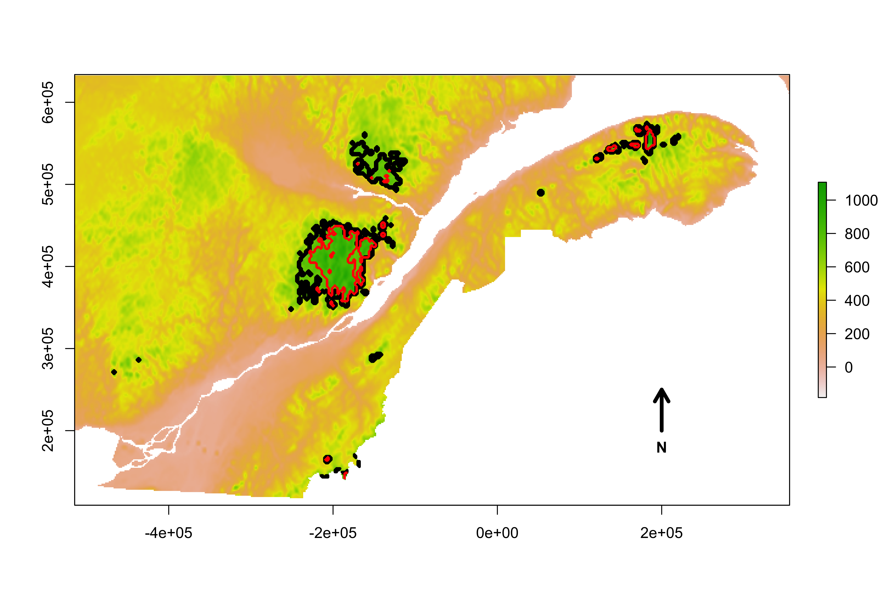

Consider a metapopulation as a population of populations connected by dispersal where the landscape in which it occurs is composed of a set of suitable and unsuitable habitat patches.
Metapopulation are perfeclty suited to caracterize fragmented distributions.
Metapopulation theory predicts that heterogeneous landscape can support the long term persistence of a species' metapopulation if a sufficient fraction of habitat patches are remains occupied at all time. 
This means that the equilibrium is dynamic as occupied patches can change, and is affected by local patch abiotic and biotic suitability, and also by the species’ ability to occupy suitable patches.
Thus, species persistence, and landscape suitability, are functions of local environmental conditions and landscape connectivity.

We can use metapopulation theory to measure the landscape's ability to sustain a metapopulation. 
Metapopulation capacity gives the conditions for a species persistence given the landscape's patch area and interpatch distance (Hanski 2000).

In this regard, climate change can profoundly alter the landscape as experienced by species.
When looking at local patches individually, climate warming alters the distribution of environmental conditions and causes elevational shifts of suitable climatic conditions.
The consequence is patch size contraction or extinction of the smaller ones (n_{700}=55, n_{800}=35; Fig. 1).
Larger patches can also become fragmented into smaller ones (Fig. 1).

Not only smaller patches are assumed to support smaller population sizes, have superior extinction risks and produce fewer colonizers (Hanski 2000), but the loss and the fragmentation of patches alter species dispersal ability through the loss of connectivity (Pimm 2006, Huang 2020).

The consequence of a 100m elevation of the distribution limit is best captured by the 37.7% reduction in metapopulation capacity which represents a significant decrease of the metapopulation extinction threshold (Fig. 1).
The overall effect of climate changes is not only to modify local patches, but to change species ability to colonize and occupy these patches. 
Consequently, at the metapopulation level, climate warming can reduce metapopulation chance of persistence on the landscape.

{ width=100% }
**Figure 1:** Map showing the potential contraction of the Bicknell's thrush climatic habitat in southern Québec (Canada) to climate warming. Black contour lines delimit habitat patches at elevations greater than 700m, and red contour lines elevations of 800m, simulating a hundred meter shift of climatic conditions on landscape suitability. Metapopulation capacity declines by 37.7% and habitat area is significantly reduced with an increase of the distribution limit from 700m to 800m.
